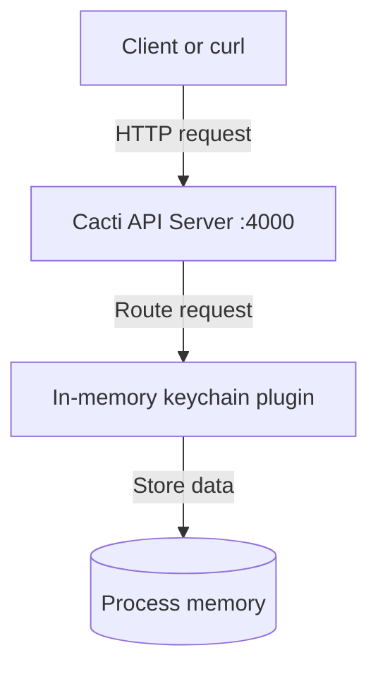

# @hyperledger-cacti/cacti-starter

## Overview

A minimal Hyperledger Cacti application that starts the Cacti API server with the in-memory keychain plugin. It provides a small, editable onboarding example for local development.

### Target Audience

- [x] Application developers
- [x] Contributors
- [ ] Operators

> This example disables authentication and TLS for simplicity. Do not use this configuration in production.

## Install

Use Node.js 20.20.0 and Corepack-enabled Yarn. From this directory:

```bash
./bootstrap.sh
```

The bootstrap script installs the repository dependencies and prepares the starter configuration.

## Configuration

The .config.json file configures the API server on port 4000 and loads @hyperledger-cacti/cactus-plugin-keychain-memory. The example includes self-signed certificate material because the Cacti configuration schema requires certificate values even when apiTlsEnabled is false.

For production deployments, enable TLS, use certificates issued for the deployment, and configure an appropriate authorization protocol.

## API Summary

The example exposes the API server and the endpoints registered by the in-memory keychain plugin. Swagger UI is available at http://127.0.0.1:4000/api/v1/api-docs/ while the application is running.

Relevant Cacti packages:

- [Cacti API server](https://github.com/hyperledger-cacti/cacti/tree/main/packages/cactus-cmd-api-server)
- [In-memory keychain plugin](https://github.com/hyperledger-cacti/cacti/tree/main/packages/cactus-plugin-keychain-memory)

## Usage

Start the example:

```bash
./run.sh
```

The request flow is:



## Testing

With the application running, use a second terminal:

```bash
./test.sh
```

The script exercises the keychain endpoint exposed by the starter.

## Contributing

See the repository [contribution guidelines](../../CONTRIBUTING.md).

## Acknowledgments

This example uses Hyperledger Cacti packages maintained in the [main Cacti repository](https://github.com/hyperledger-cacti/cacti).
